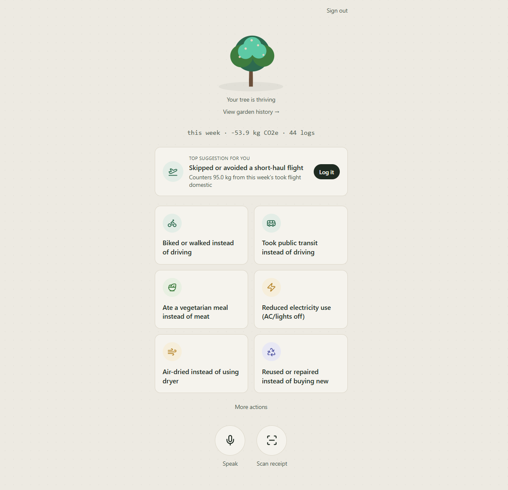
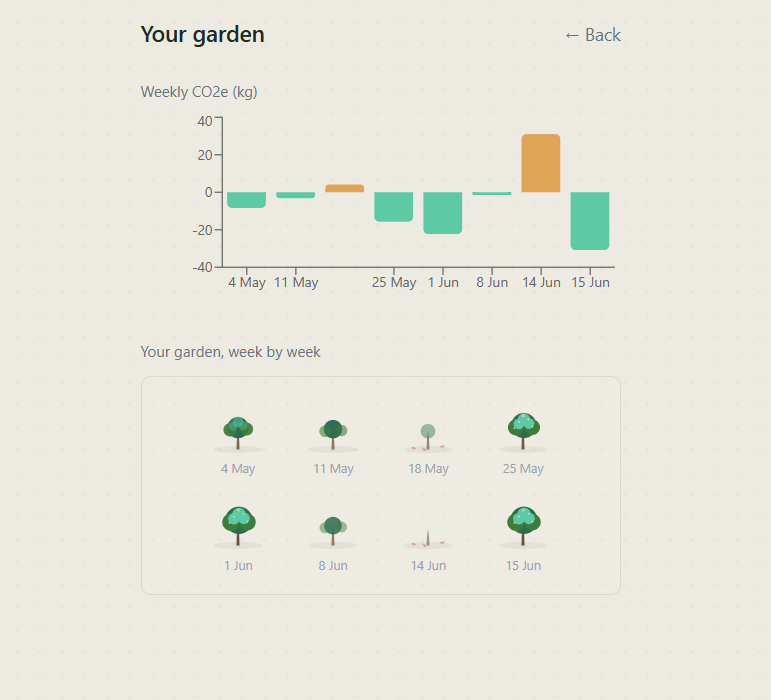
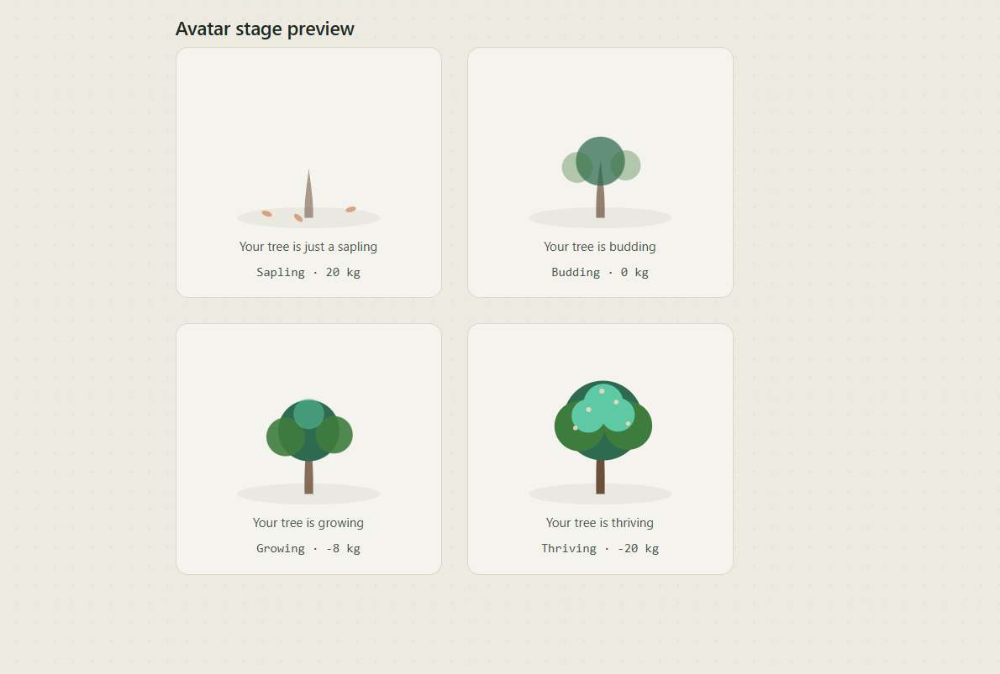

# Carbon Twin 🌳

**Track your carbon footprint. Watch it grow.**

Carbon Twin turns carbon tracking into something you actually want to check — a small tree that visibly grows, blooms, or wilts based on your real weekly actions. Instead of one tedious way to log your impact, it offers four: tap a quick action, speak it, scan a receipt, or (in progress) let it detect a walk or bike ride automatically. Every number behind it comes from a real, auditable emissions-factor table — not an AI guess.

---

## The problem

Most carbon trackers fail for the same two reasons: they're boring (a number on a dashboard nobody opens twice), and they're tedious (manual entry that gets abandoned by day three). Carbon Twin is built around removing both failure modes — an emotionally engaging visual instead of a spreadsheet, and near-zero-friction logging instead of forms.

---

## Features

### 🌱 A tree that reacts to your real data
The avatar moves through four real growth stages — sapling, budding, growing, thriving — driven entirely by this week's net CO2e. Full canopy and blossoms only appear once you've genuinely avoided enough emissions; fallen leaves appear when you haven't.

### 📝 Four ways to log, one pipeline
- **Quick-action tap** — one tap for common actions (biked, veg meal, transit, etc.)
- **Voice log** — speak naturally ("I biked to work today"); Claude parses it into a structured action
- **Receipt/photo scan** — snap a grocery receipt; Claude's vision extracts line items and categorizes them, no manual entry
- **Passive trip detection** *(built, not yet wired in — see Known Limitations)* — browser geolocation infers walking/biking trips automatically

All four converge on the same emissions-factor lookup and the same atomic weekly scoring system.

### 💡 Personalized, data-driven suggestions
Not generic eco-tips — Carbon Twin looks at what you actually logged this week, finds your single biggest emission contributor, and recommends the specific counter-action with the highest impact. If you haven't logged anything yet, it suggests the highest-leverage action you haven't tried.

### 📊 Garden history
A weekly bar chart plus a row of miniature trees, so a single good (or bad) week becomes part of a visible trend, not an isolated snapshot.

### 🔐 Real authentication
Sign in with Google, email magic link, or continue as a guest — your data is yours, enforced by Postgres row-level security, not just convention.

---

## How it works

```
┌─────────────────┐   ┌──────────────────┐   ┌─────────────────┐   ┌──────────────────┐
│  Quick-action    │   │  Receipt / photo │   │   Voice log      │   │  Passive motion  │
│  tap             │   │  scan            │   │                  │   │  (parked)        │
└────────┬─────────┘   └────────┬─────────┘   └────────┬─────────┘   └────────┬─────────┘
         │                      │                       │                      │
         │              ┌───────▼───────┐       ┌───────▼───────┐              │
         │              │ Claude vision │       │ Web Speech API │             │
         │              │ OCR + parse   │       │ + Claude parse │             │
         │              └───────┬───────┘       └───────┬───────┘              │
         │                      │                       │                      │
         └──────────────────────┴──────────────────────┴───────────────────────┘
                                              │
                                  ┌───────────▼────────────┐
                                  │  Confirm screen          │
                                  │  (user verifies/edits     │
                                  │  before anything is logged)│
                                  └───────────┬────────────┘
                                              │
                                  ┌───────────▼────────────┐
                                  │  Static emissions-factor │
                                  │  lookup (JSON, no API)   │
                                  └───────────┬────────────┘
                                              │
                                  ┌───────────▼────────────┐
                                  │  Atomic weekly score     │
                                  │  update (Postgres RPC)   │
                                  └─────┬──────────────┬────┘
                                        │              │
                              ┌─────────▼───┐   ┌──────▼──────────┐
                              │ Avatar       │   │ Personalized    │
                              │ reacts       │   │ suggestion      │
                              └──────────────┘   └─────────────────┘
```

**Why a static emissions table instead of an AI estimate?** Costs (numbers stay defensible and auditable — anyone can open `data/emissions_factors.json` and check the source), speed (instant, no API round-trip for the math itself), and reliability (no risk of the model hallucinating a number mid-demo). The AI's job is purely *classification* (which category does this belong to), never *quantification* (how much CO2e is that).

---

## Screenshots

*(Add screenshots here before submitting — recommended set: home screen with tree + suggestion card, the log/voice/scan flow, the confirm screen, and the garden history page.)*

| Home |
|---|
| 

| Garden History |
|---|
| 

| Avatars |
|---|
| 

---

## Tech stack

| Layer | Choice | Why |
|---|---|---|
| Frontend | Next.js (App Router) + Tailwind | Single JS/TS codebase, fast to build, deploys cleanly to Vercel's free tier |
| Auth + DB | Supabase (Postgres) | Free tier, built-in RLS, anonymous + OAuth + email auth out of the box |
| AI | Claude Haiku (`claude-haiku-4-5`) | Cheap enough that the entire build stayed under $5, capable enough for classification + vision OCR |
| Charts | Recharts | Lightweight, themeable |
| Icons | Lucide React | Consistent icon set for category visual language |
| Testing | Vitest | Fast unit tests on the pure emissions/trip-detection logic |

---

## Architecture notes for reviewers

- **`data/emissions_factors.json`** — the single source of truth for every kg CO2e figure in the app. Two sections: `purchase_categories` (₹-per-100-spent factors for receipt items) and `action_categories` (per-event factors for quick actions/voice logs).
- **`lib/recommendations.ts`** — the suggestion engine. Deliberately rule-based, not another LLM call: it sums this week's positive-emission logs by category, maps the biggest contributor to a counter-action via `lib/counterActions.ts`, and falls back to "highest-impact action you haven't tried" if there's nothing to counter yet.
- **`increment_weekly_score`** (Postgres function) — does the weekly-score upsert atomically (`ON CONFLICT ... DO UPDATE`) to avoid race conditions when multiple logs land in quick succession.
- **Row-level security** is enabled on both `logs` and `weekly_scores` — even with the anon key exposed client-side (expected with Supabase), a user can only ever read or write their own rows.
- **Rate limiting** (`lib/rateLimit.ts`) is a simple in-memory, per-IP limiter on the two Claude-calling API routes, to protect the budget if the deployed link is shared publicly. Documented as a known limitation: it resets on serverless cold starts and isn't a substitute for a distributed limiter at real scale.

---

## Known limitations

- **Passive trip detection** is fully built and unit-tested (`lib/tripDetection.ts`, `components/PassiveTripWatcher.tsx`) but not currently wired into the main app — browser geolocation proved too inconsistent across OS/browser combinations to rely on for a live demo. It's a natural next step for a native or PWA version with proper background-location permissions.
- **Chart accessibility**: the weekly bar chart has a visually-hidden data-table fallback for screen readers, but is not independently navigable bar-by-bar the way a purpose-built accessible charting library would allow.
- **Rate limiting** is in-memory per-instance, not distributed — fine for hackathon-scale traffic, not production-grade.

---

## Testing

```bash
npm test
```

18 unit tests cover the emissions lookup logic and trip-detection math (the parts most likely to silently break and hardest to catch via manual UI testing). See `lib/emissions.test.ts` and `lib/tripDetection.test.ts`.

A manual test checklist for the full user-facing flow is in `TESTING.md`.

---

## Running locally

```bash
git clone <your-repo-url>
cd carbon-twin
npm install
cp .env.example .env.local   # then fill in your own keys
npm run dev
```

Required environment variables (see `.env.example`):
- `NEXT_PUBLIC_SUPABASE_URL`
- `NEXT_PUBLIC_SUPABASE_ANON_KEY`
- `ANTHROPIC_API_KEY`

---

## Cost

Built and tested for **under $5 total**. Everything except Claude API calls runs on free tiers (Vercel, Supabase). Claude Haiku calls for receipt/voice parsing cost fractions of a cent each.

---

## What's next

- Wire up passive trip detection on a native/PWA build with proper background location permissions
- Social/neighborhood comparison layer
- Bank/UPI transaction feed as an alternative to receipt photos
